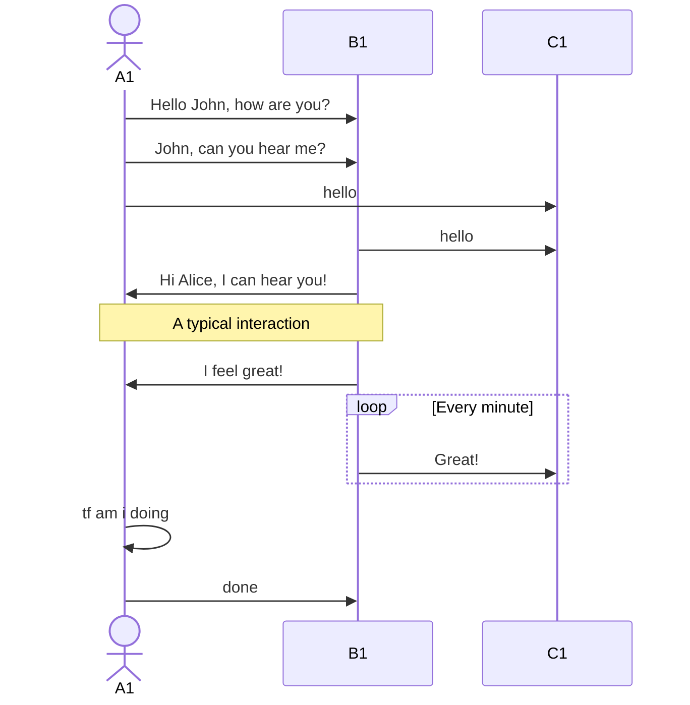
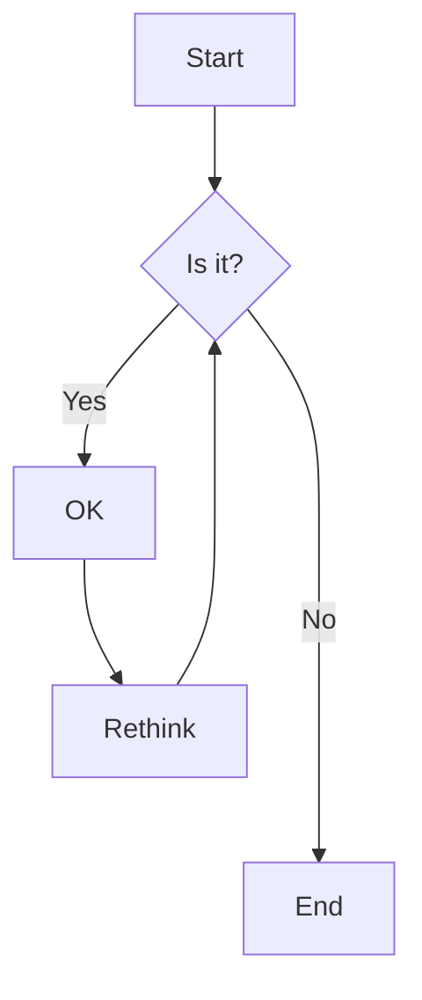
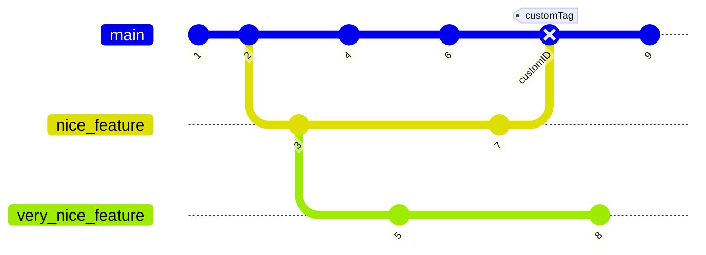

- [ ] ok
- [x] not ok

Subjects
- test 1 ello
- test 2
- [[Combinatorial logic]] 
- [[Math Definitions]] 
- ==test==
	- [x] test
	- test
		- test2 test
- not end
	- indent

this i meant to be a normal paragraph.
lets see.  
if it works

# h1
## h2
**bold** bold
*italic*
~~strike~~
1. [ ] Do first step
2. [ ] Do next step
3. [x] Do following step
	1. [ ] test2
		1. [ ] test3

```css
* {
  background-color: white;
}
```

a very long string|almost as long|very long
--:|:--:|:--
d|e|f
g|h|i




